# P같은 J 플래너

## 📆 개발 기간
> 2023.05 (1개월)

## 목차

1. [프로젝트 기획 배경](#프로젝트-기획-배경)
2. [프로젝트 목표](#프로젝트-목표)
3. [주요기능](#주요기능)
4. [서비스 화면](#서비스-화면)
5. [기술차별점](#기술차별점)
6. [개발환경](#개발환경)
7. [프로젝트 구조](#프로젝트-구조)
8. [팀원](#팀원)
9. [프로젝트 산출물](#프로젝트-산출물)
10. [프로젝트 발표자료](#프로젝트-발표자료)
 

## 프로젝트 기획 배경

2023년, 코로나가 막 끝난 시점 사람들은 무엇을 제일 하고싶어할까? 라는 의문점이 들었다.
게임, 대화, 공부 등 실내 활동에 지친 현대인들은 모두 '여행' 이라는것에 시선을 돌릴수 밖에없을것이다.
하지만 '여행'이라는것은 마냥 쉽지만은 않다. 일정을 짜야한다는 부담감, 개개인들의 여행스타일이 나누어질수있다는 갈등,
저러한 이유들 덕분에 계획없이 여행을 재미없게 가거나 여행을 안가는 사람들이 많다. 여행 계획을 짜는것은 마치 숙제같은 존재이다. 내가 아닌 누군가가 해줬으면 하는 바람이 존재한다.
우리는 현재 현대인들이 가지고있는 불편함을 해결할수없을까란 의문을 가지고 먼저 현대인들의 여행 패턴을 분석하였다.

### 1. 즉흥여행 선호
숙소 예약 데이터를 분석한 결과, 여행객 10명중 2.4명은 1주일 이내로 즉흥적인
여행을 선호하는 사람들이 많다는것을 인지할수있다.

### 2. Slow Plan
여행자 한명이 여행을 계획하는데 걸리는 소요시간은 총 45일, 평균에 하루에 1시간이 소요되는 점을 보았을때
여행계획을 짜는것은 시간이 많이걸린다는 점을 인지할수있다.

### 3. 부담감
다수 인원들은 여행 계획하는것을 부담스러워 하거나 저장할 공간이 마땅치 않아 포기한다.
이러한 부분들은 여행을 가는 시작점부터 부담감을 느껴 여행을 안가는 원인으로 작용될수있다/.

## 프로젝트 목표

P같은 J는 다음 3가지의 목표가 있습니다.

1. 즉흥적인 여행을 할 수 있는 서비스
2. 바쁜 현대 사회에 빠르게 여행을 계획할 수 있는 서비스
3. 실시간으로 주변의 관광지를 확인하고 저장할 수 있는 서비스

지역별로 제공되는 관광지 목록을 확인하여, 바쁜 일상 속에서도 빠르게 여행 계획을 구성할 수 있는 서비스를 목표로 합니다. 또한 사용자가 즉시 여행을 할수있게, 즉흥적인 여행을 제안합니다. 지역의 관광지 목록이 즉시 제공되어 선택의 폭을 넓히고, 플래너 저장을 통해 손쉬은 여행 계획을 만들 수 있습니다. 
 
 

## 주요기능

### 여행 만들기
카카오맵 API와 한국 여행지 및 숙소 DB를 활용하여 사용자가 원하는 날짜고르고
날짜에 해당하는 일수에 맞춰서 숙소와 여행지를 맵에서 고르는 기능입니다.
맵이 다 만들어진다면 나의 플랜 일정에 자동으로 담겨집니다.

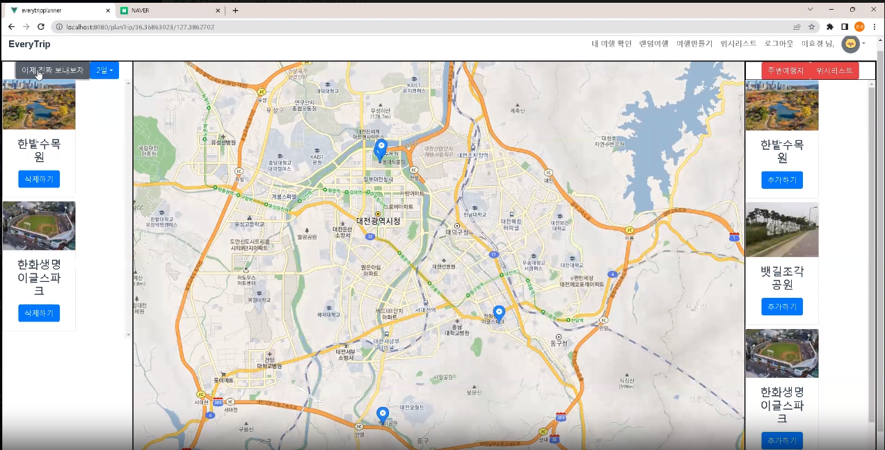

### 최적 경로 기반 일정 보기
나의 플랜 일정을 볼수있다면 카카오맵 API에 일자에 맞춰서 색깔별로 최적의 루트를 보여준다.

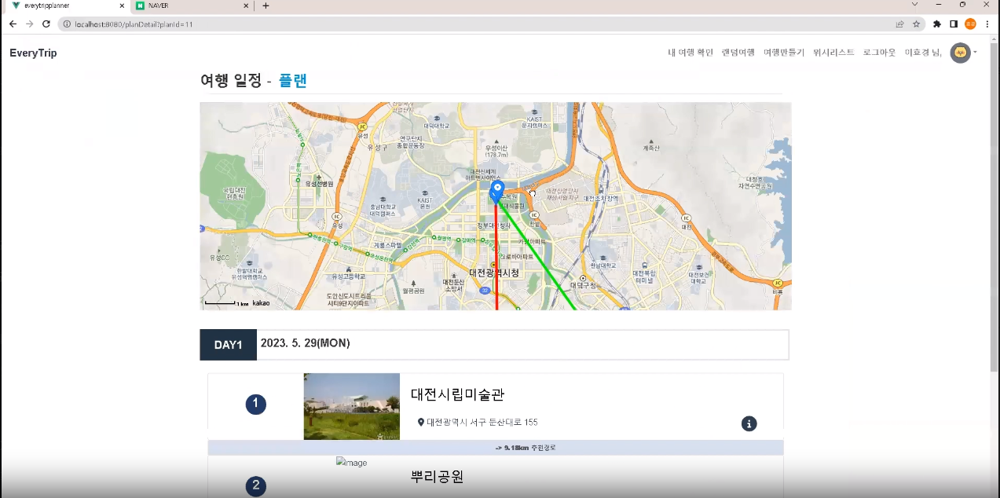

### 랜덤 여행 만들기
룰렛의 결과값에 맞춰서 자동으로 해당지역의 여행계획을 추천한다.
마음에 들지않는다면 카테고리별로 해당지역의 관광지를 추천해준다.

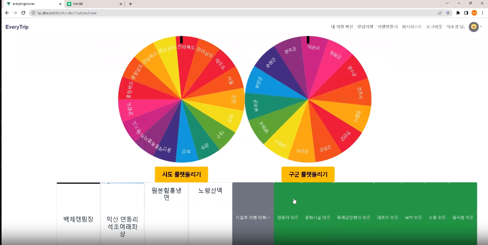
### 카테고리별 여행지 확인
관광지 DataBase를 토대로 Join문을 사용하여 해당하는 카테고리에있는 값들을 사용자에게 
여행지를 미리 확인할수있게 해준다.
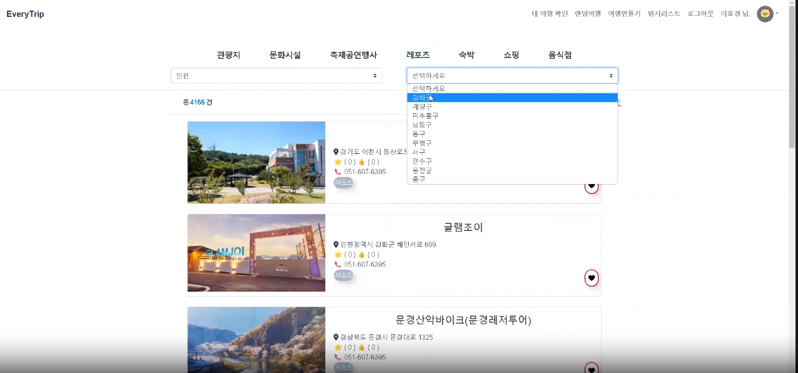

### 근처 여행지 확인
선택한 여행지 주변에있는 근처 여행지를 볼수있다. 마커뿐만아니라 사진, 좋아요, 별점, 거리를 통해서
추가적인 여행을 할수있다.

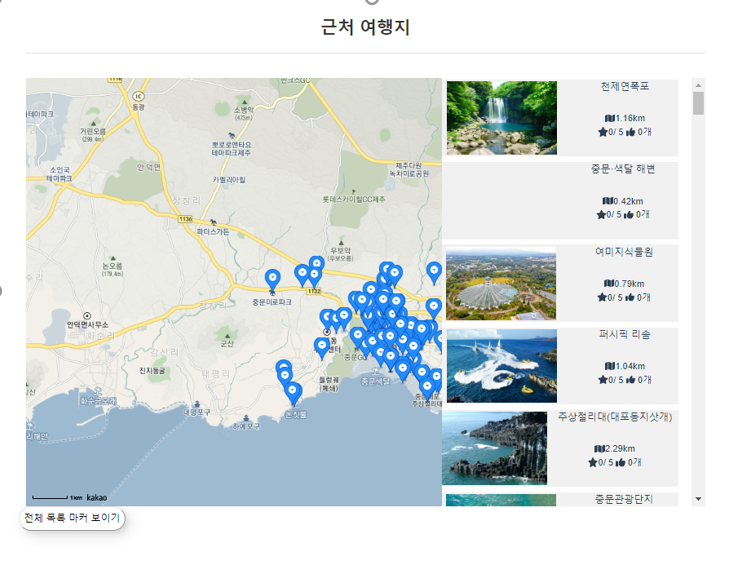
### 여행 일정 공유
남이 만든 여행 일정, 내 친구가 만든 여행 일정, 한 지역에있는 추천 여행 일정을 보면서 
여행계획을 짜기힘들거나 귀찮을때, 또한 추가적으로 여행지에대한 추천을받고싶을때
여행일정을 서로 공유하여 여행계획을 손쉽게 작성할수있다.

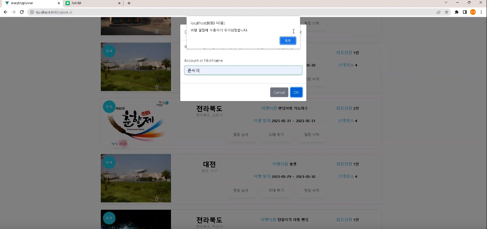

 

## 서비스 화면

 

### 메인 화면
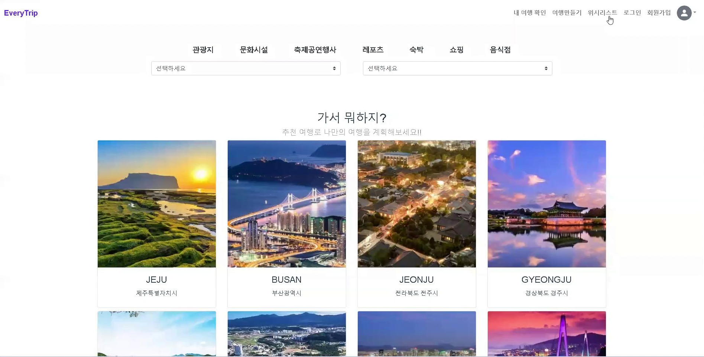
 

### 로그인
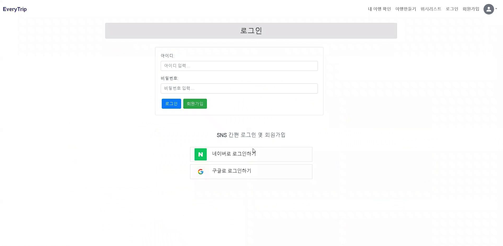
- 자체 로그인과 소셜로그인(네이버/ 구글)을 통해 간편하게 로그인할 수 있습니다.
 

### 마이페이지
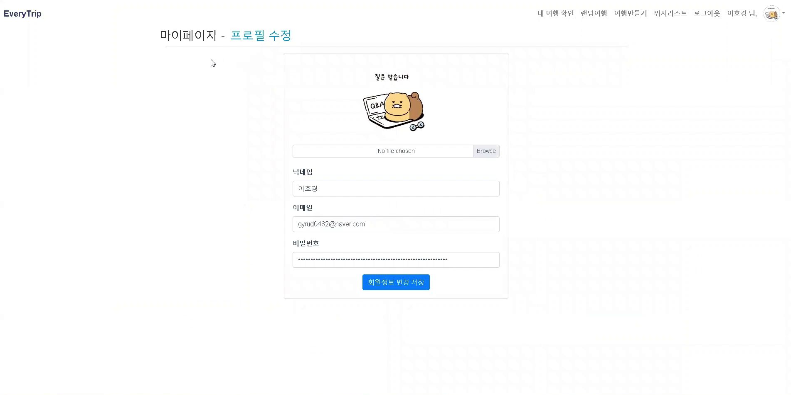
- 마이페이지를 통해 닉네임과 프로필 이미지를 수정할 수 있습니다.
 

### 지역별 여행지 목록  
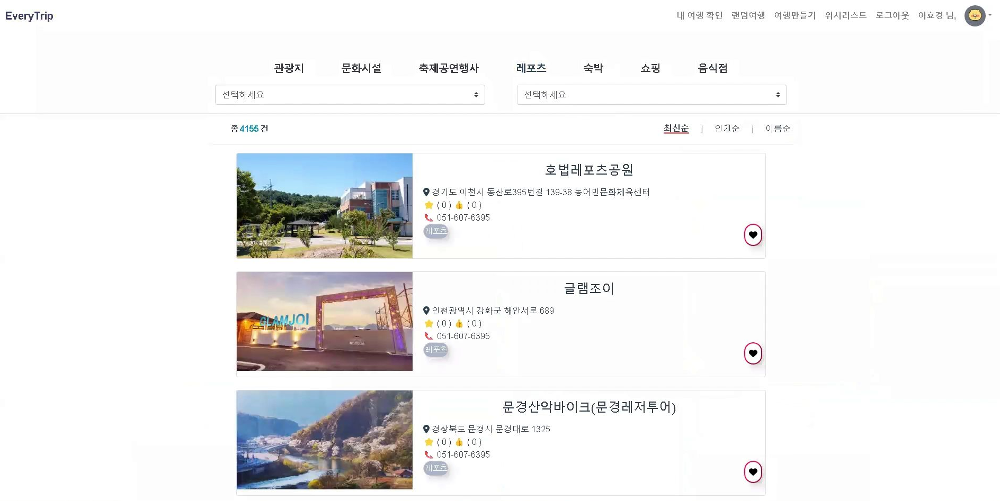
- 시도 / 구군 선택을 통해 지역별 여행지를 목록을 확인하실 수 있습니다.
 

### 여행지 상세 보기
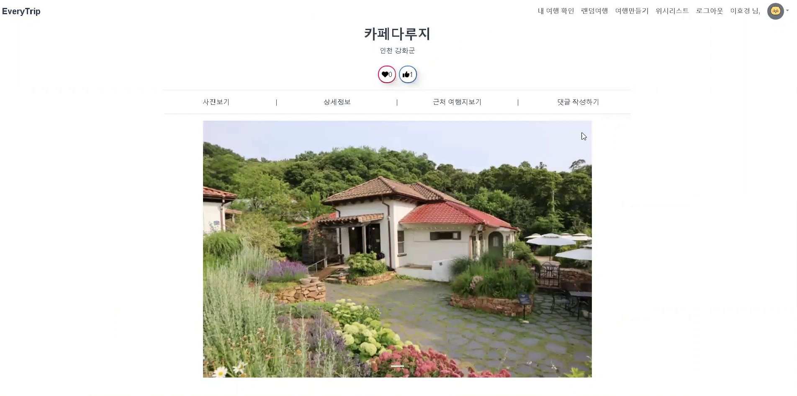
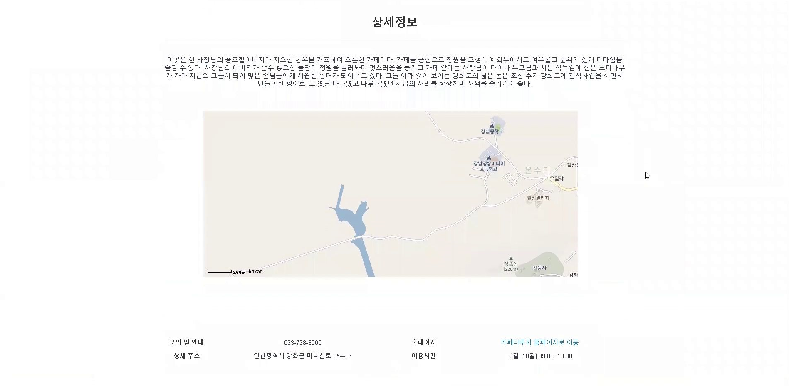
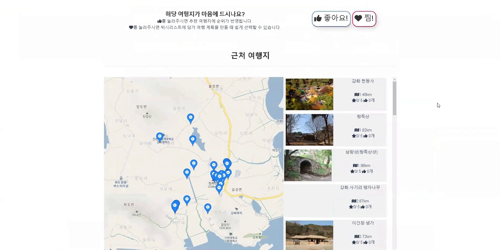
 

### 여행 스케줄링
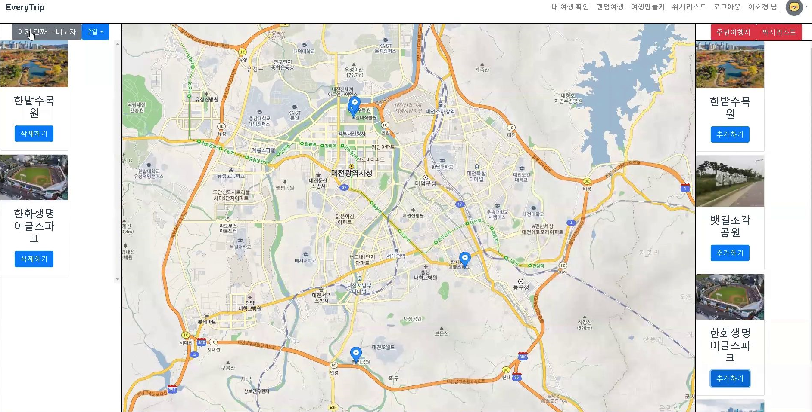
- 지도를 통해 위치를 이동하고 간편하게 주변 여행지를 확인할 수 있습니다.
- 날짜를 선택하고 근처 여행지를 간편하게 추가하여 여행 일정을 생성할 수 있습니다.

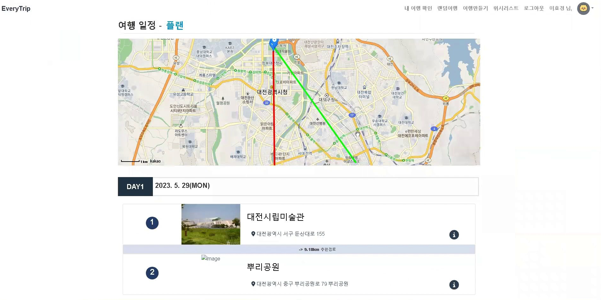
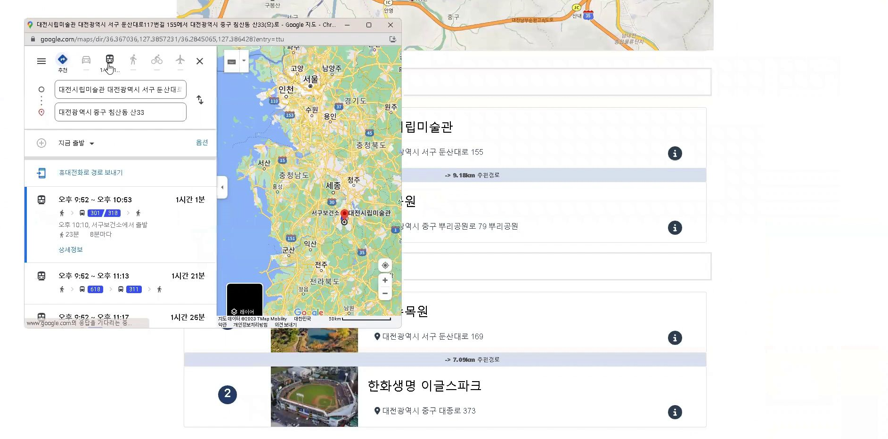
- 최단 경로 생성된 여행 일정을 확인할 수 있습니다.
- 지도를 통해 일자별 최단 경로를 확인하고, 여행지 사이의 이동할 수 있는 추천경로도 제공합니다.
 

### 룰렛 여행 일정
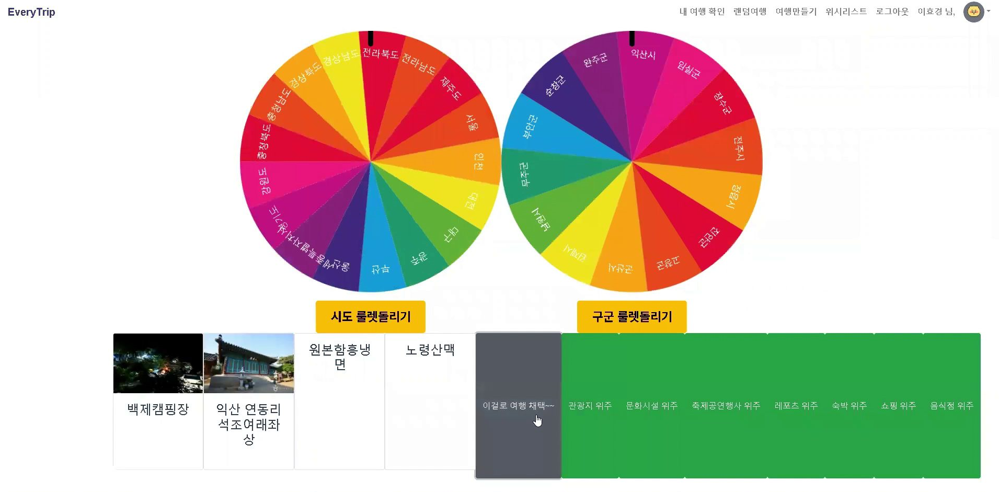
- 여행 테바를 선택 한 후, 시도와 구군의 룰렛을 돌리면 랜덤 여행지가 선정됩니다. 
- 여행 테마를 기반으로한 룰렛 여행 생성으로 즉흥적인 여행을 생성할 수 있습니다.
 

### 위시리스트
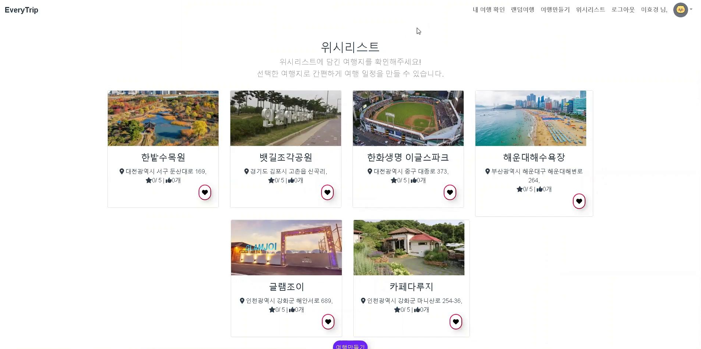
- 찜을 누른 여행지 목록을 확인할 수 있고, 간편하여 위리스트의 여행지 목록으로 여행을 만들 수 있습니다.
 
 

## 주요 기술

### 최단 경로 알고리즘 적용
해당 일자의 선택한 여행지들을 넣은 순서와 상관없이 첫번째 여행지를 토대로 제일 빠른 경로를 알아야했었음.
Greedy Algorithm을 적용하여 현 최선의 선택지만을 골라가며 최단경로의 알고리즘으로 선택하였음

### 페이징 처리
카테고리별, 좋아요순, 기능별순 기능을 구현하여 사용자에게 여러개의 data를 보내주어야하기때문에 
페이징 처리를 우선시하였음
페이지를 연산할 변수와 총 레코드수를 반환하는 SQL을 추가하여 Mybatis의 Query문을 통해 페이징 처리를 적용하였음

### 랜덤 룰렛 기능
여행지를 잘못정하거나 여행계획을 짜기싫어하는 사람들을 위해 랜덤이라는 재미요소를 추가하였음
시도별, 구군별에 따라서 룰렛을 돌려 원하는 선택지가 나오게 하였다. 룰렛의 width, height , angle을 따져
구군별로 angle을 나누고 배열의 값에 맞춰 랜덤으로 나온 결과값을 도출해내였음

### 카카오,네이버 로그인
OAuth2 인증과정을 통해 카카오,네이버 로그인 기능을 구현하였음 
Client에서 Resource Owner를 대신하여 Authorziation Server와 Resource Server에 요청을 보내 
로그인을 수행한다.

## 개발환경

### Front-end
| Category          | Stack                                                                           |
| ----------------- | ------------------------------------------------------------------------------- |
| Language          | - Javascript                                                                    |
| Framework         | - Vue.js                                                                       |

### Back-end
| Category          | Stack                                                                           |
| ----------------- | ------------------------------------------------------------------------------- |
| Framework         | - Spring Boot                                                           |
| Database          | - MySql  - 공공데이터                                                           |

### Communication
| Category          | Stack                                                                           |
| ----------------- | ------------------------------------------------------------------------------- |
| Documents         | - Notion                                                    |
| Tools             | - Figma  - Swagger                                                           |
 
 

## 프로젝트 구조
├─ .DS_Store  
├─ .gitignore  
├─ README.md  
├─ Servers  
│  ├─ .project  
│  ├─ .settings  
│  │  └─ org.eclipse.wst.server.core.prefs  
│  └─ VMware tc Server Developer Edition v4.1-config  
│     ├─ catalina.policy  
│     ├─ catalina.properties  
│     ├─ context.xml  
│     ├─ jmxremote.access  
│     ├─ jmxremote.password  
│     ├─ server.xml  
│     ├─ tomcat-users.xml  
│     └─ web.xml  
├─ everytripplanner  
│  ├─ .gitignore  
│  ├─ README.md  
│  ├─ babel.config.js  
│  ├─ jsconfig.json  
│  ├─ package-lock.json  
│  ├─ package.json  
│  ├─ public  
│  │  ├─ favicon.ico  
│  │  └─ index.html  
│  ├─ src  
│  │  ├─ App.vue  
│  │  ├─ api  
│  │  │  ├─ attraction.js  
│  │  │  ├─ comment.js  
│  │  │  ├─ fontAwesomeIcon.js  
│  │  │  ├─ http.js  
│  │  │  ├─ items  
│  │  │  │  └─ item.js  
│  │  │  ├─ like.js  
│  │  │  ├─ member.js  
│  │  │  ├─ plan.js  
│  │  │  ├─ vueBootstrap.js  
│  │  │  └─ wishList.js  
│  │  ├─ assets  
│  │  │  ├─ NaverIcon.png  
│  │  │  ├─ googleIcon2.png  
│  │  │  ├─ googleIcon3.png  
│  │  │  ├─ google_btn.png  
│  │  │  ├─ logo.png  
│  │  │  ├─ mainPlanImg  
│  │  │  │  ├─ daejeon.jpg  
│  │  │  │  ├─ gangneung.jpg  
│  │  │  │  ├─ googleIcon3.png  
│  │  │  │  ├─ gunsan.jpg  
│  │  │  │  ├─ gyeongju.jpg  
│  │  │  │  ├─ jeju.jpg  
│  │  │  │  ├─ jeonju.jpg  
│  │  │  │  ├─ yeongwol.jpg  
│  │  │  │  └─ yeosu.jpg  
│  │  │  ├─ naver_btn.png  
│  │  │  ├─ noImage.png  
│  │  │  └─ user.png  
│  │  ├─ components  
│  │  │  ├─ Attraction  
│  │  │  │  ├─ AttractionComment.vue  
│  │  │  │  ├─ AttractionDetai l.vue  
│  │  │  │  ├─ ChooseAttraction.vue  
│  │  │  │  ├─ NearAttraction.vue  
│  │  │  │  ├─ Sido  
│  │  │  │  │  ├─ ChooseGuGun.vue  
│  │  │  │  │  └─ ChooseSido.vue    
│  │  │  │  └─ TopAttraction.vue  
│  │  │  ├─ Plan  
│  │  │  │  ├─ RandomGugun.vue  
│  │  │  │  ├─ RandomSido.vue  
│  │  │  │  ├─ TopPlanAddr.vue  
│  │  │  │  ├─ TopTripPlan.vue  
│  │  │  │  ├─ items  
│  │  │  │  │  ├─ AttractionAdd.vue  
│  │  │  │  │  ├─ AttractionList.vue  
│  │  │  │  │  └─ ShowAttraction.vue  
│  │  │  │  ├─ showAttractionList.vue  
│  │  │  │  ├─ showMapView.vue  
│  │  │  │  └─ showPlanList.vue  
│  │  │  ├─ Sign  
│  │  │  │  ├─ NaverLoginButton.vue  
│  │  │  │  ├─ ToSigInView.vue  
│  │  │  │  └─ ToSignupView.vue  
│  │  │  └─ TheHeaderNavi.vue  
│  │  ├─ main.js  
│  │  ├─ router  
│  │  │  └─ index.js  
│  │  ├─ store  
│  │  │  ├─ index.js  
│  │  │  └─ modules  
│  │  │     ├─ Attrraction.js  
│  │  │     ├─ items  
│  │  │     │  └─ itemStore.js  
│  │  │     ├─ memberStore.js  
│  │  │     ├─ planStore.js  
│  │  │     └─ wishListStore.js  
│  │  └─ views  
│  │     ├─ AttractionDetailView.vue  
│  │     ├─ AttractionListView.vue  
│  │     ├─ MainView.vue  
│  │     ├─ MyPageView.vue  
│  │     ├─ MyWishList.vue  
│  │     ├─ PlanDetailVew.vue  
│  │     ├─ PlanListView.vue  
│  │     ├─ PlanTripVie.vue  
│  │     ├─ RandomTripDetailView.vue  
│  │     ├─ SigninView.vue  
│  │     ├─ SignupView.vue  
│  │     ├─ UserModify.vue  
│  │     └─ loginRedirect.vue  
│  └─ vue.config.js  
└─ myTrip  
├─ .DS_Store  
├─ .gitignore  
├─ .mvn  
│  └─ wrpper  
│     ├─ maven-wrapper.jar   
│     └─ maven-wrapper.properties  
├─ Servers  
│  └─ VMware tc Server Developer Edition v4.1-config  
│     ├─ catalina.policy   
│     ├─ catalina.properties  
│     ├─ context.xml  
│     ├─ jmxremote.access  
│     ├─ jmxremote.password  
│     ├─ server.xml  
│     ├─ tomcat-users.xml  
│     └─ web.xml  
├─ mvnw  
├─ mvnw.cmd  
├─ pom.xml  
└─ src  
├─ main  
│  ├─ java  
│  │  └─ com  
│  │     └─ trip  
│  │        └─ project  
│  │           ├─ MytripApplication.java  
│  │           ├─ Test.cld  
│  │           ├─ config  
│  │           │  ├─ CustoBCryptPasswordEncoder.java  
│  │           │  ├─ CustomAuthenticationSuccessHandler.java  
│  │           │  ├─ SecurityConfig.java  
│  │           │  ├─ SwaggerConfig.java  
│  │           │  ├─ TomcatConfig.java  
│  │           │  ├─ auth  
│  │           │  │  ├─ PrincipalDetailService.java  
│  │           │  │  └─ PrincipalDetails.java  
│  │           │  ├─ filter  
│  │           │  │  └─ UnauthorizedException.java  
│  │           │  └─ oauth  
│  │           │     ├─ PrincipalOauth2UserService.java  
│  │           │     └─ provider  
│  │           │        ├─ GoogleUserInfo.java  
│  │           │        ├─ NaverUserInfo.java  
│  │           │        └─ OAuth2UserInfo.java  
│  │           ├─ controller  
│  │           │  ├─ attaction  
│  │           │  │  └─ AttracitonController.java  
│  │           │  ├─ comment  
│  │           │  │  └─ CommentController.java  
│  │           │  ├─ like  
│  │           │  │  └─ LikeController.java    
│  │           │  ├─ plan  
│  │           │  │  └─ PlanController.java  
│  │           │  ├─ user  
│  │           │  │  └─ UserController.java  
│  │           │  └─ wishList      
│  │           │     └─ WishListController.java    
│  │           ├─ dto    
│  │           │  ├─ attraction  
│  │           │  │  ├─ Attraction.java  
│  │           │  │  ├─ AttractionDescriptionDto.java    
│  │           │  │  ├─ AttractionDto.java  
│  │           │  │  ├─ AttractionNear.java  
│  │           │  │  ├─ AttractionRepository.java  
│  │           │  │  ├─ GugunDto.java  
│  │           │  │  ├─ RouteAttractionDto.java  
│  │           │  │  ├─ RouteDistanceDto.java  
│  │           │  │  ├─ RouteResponseDto.java  
│  │           │  │  ├─ SidoDto.java  
│  │           │  │  └─ SidoGugunCodeDto.java  
│  │           │  ├─ comment  
│  │           │  │  ├─ CommentDto.java  
│  │           │  │  ├─ CommentFileDto.java  
│  │           │  │  ├─ CommentFileRepository.java  
│  │           │  │  └─ CommentRepository.java  
│  │           │  ├─ like  
│  │           │  │  ├─ LikeAttractionDto.java  
│  │           │  │  ├─ LikeAttractionRepository.java  
│  │           │  │  ├─ LikeListDto.java  
│  │           │  │  └─ LikeRepository.java  
│  │           │  ├─ plan  
│  │           │  │  ├─ Plan.java  
│  │           │  │  ├─ PlanDetail.java  
│  │           │  │  ├─ PlanList.java  
│  │           │  │  ├─ PlanListRepository.java  
│  │           │  │  ├─ PlanListRequestDto.java  
│  │           │  │  ├─ PlanRepository.java  
│  │           │  │  ├─ PlanRequestDto.java  
│  │           │  │  └─ UserPlanList.java  
│  │           │  ├─ team  
│  │           │  │  ├─ Team.java  
│  │           │  │  └─ TeamRepository.java  
│  │           │  ├─ user   
│  │           │  │  ├─ UserDto.java  
│  │           │  │  ├─ UserFileDto.java     
│  │           │  │  ├─ UserFileRepository.java  
│  │           │  │  └─ UserRepository.java  
│  │           │  └─ wishList  
│  │           │     ├─ WishListDto.java  
│  │           │     └─ WishListRepository.java  
│  │           ├─ interceptor  
│  │           │  └─ JwtInterceptor.java  
│  │           ├─ newfile.ucd  
│  │           ├─ service  
│  │           │  ├─ attraction  
│  │           │  │  └─ AttractionService.java  
│  │           │  ├─ comment  
│  │           │  │  └─ CommentService.java  
│  │           │  ├─ jwt  
│  │           │  │  ├─ JwtService.java  
│  │           │  │  └─ JwtServiceImpl.java   
│  │           │  ├─ like  
│  │           │  │  └─ LikeService.java   
│  │           │  ├─ plan  
│  │           │  │  ├─ PlanListService.java  
│  │           │  │  └─ PlanService.java  
│  │           │  ├─ team  
│  │           │  │  └─ TeamService.java  
│  │           │  ├─ user  
│  │           │  │  └─ UserService.java  
│  │           │  └─ wishList     
│  │           │     └─ WishListService.java  
│  │           └─ util  
│  │              └─ PageNavigation.java  
│  └─ resources  
│     ├─ application.properties    
│     └─ mapper  
│        ├─ AttractionRepository.xml  
│        ├─ CommentFileRepository.xml    
│        ├─ CommentRepository.xml  
│        ├─ LikeRepositoryMapper.xml    
│        ├─ PlanListRepositoryMapper.xml    
│        ├─ PlanRepositoryMapper.xml   
│        ├─ TeamRepositoryMapper.xml  
│        ├─ UserFileRepositoryMapper.xml  
│        ├─ UserRepositoryMapper.xml  
│        └─ WishListRepository.xml  
└─ test  
└─ java  
└─ com  
└─ trip  
└─ project  
└─  

## 팀원
|||
|:---:|:---:|
|정재욱|이효경|
|[@woogieme](https://github.com/woogieme)|[@HyoKyoung1004](https://github.com/HyoKyoung1004)|
 
 

## 프로젝트 산출물

### ERD
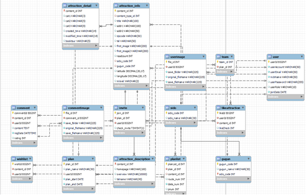

 

### 클래스다이이그램
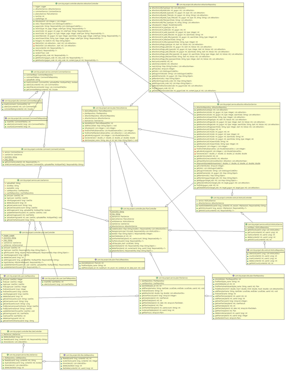
 
 

## 프로젝트 발표자료
- [최종발표 Presentation](data/P같은J플래너.pdf)

